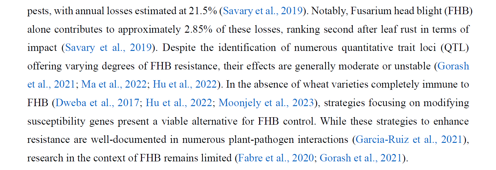
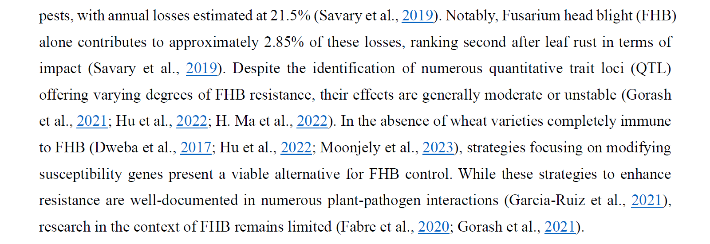

# ZoteroLinkCitation

An MS Word macro that links Zotero author-date or numeric style citations to their bibliography entry. This project was inspired by discussions of [Word: Possibility to link references and bibliography in a document?](https://forums.zotero.org/discussion/12431/word-possibility-to-link-references-and-bibliography-in-a-document)

## Features

* The script automatically detects whether the citation style used in the document has been supported.
* More than 10 citation styles have been tested, see the list of [Supported Citation Styles](#supported-citation-styles).
* The Zotero fields are preserved after linking to the bibliography.
* Allows setting a unified Word text style for newly established links, enabling changes to the link's color, size, font, etc.
* Correctly handles multiple references in the Author-Date style where the first author is the same.

## Examples

Numeric example:

Author-year example:

Author-year example (only the year part is linked):

## How to Use

> [!CAUTION]
> Before running the `ZoteroLinkCitationAll` macro, **please ensure you have backed up your document**. The operations performed by this script are bulk actions that are irreversible. A backup ensures that you can restore your original document in case anything does not go as expected.

This guide is aimed at beginners and provides detailed instructions on importing and running the `ZoteroLinkCitation.bas` script in Microsoft Word.

### Prerequisites

- Microsoft Word (2016 or later recommended for compatibility).
- The [`ZoteroLinkCitation.bas`](https://raw.githubusercontent.com/altairwei/ZoteroLinkCitation/master/ZoteroLinkCitation.bas) file.

### Step 1: Accessing the VBA Editor

1. Open Microsoft Word.
2. Press `Alt` + `F11` to open the Visual Basic for Applications (VBA) Editor.

### Step 2: Importing the VB Script

1. Within the VBA Editor, locate `Normal` in the Project window on the left. Right-click on `Normal` choose `Import File...`.
2. Locate and select your `ZoteroLinkCitation.bas` file, then click `Open` to import the script.

### Step 3: Saving Your Macro-Enabled Document

1. Exit the VBA Editor to return to your Word document.
2. Save your document as a Macro-Enabled Document (`.docm`):
   - Click `File` > `Save As`.
   - Select your desired location.
   - Choose `Word Macro-Enabled Document (*.docm)` from the "Save as type" dropdown.
   - Click `Save`.

### Step 4: Adjusting Macro Security Settings

Adjust Word’s macro settings to allow the macro to run:

1. Go to `File` > `Options` > `Trust Center` > `Trust Center Settings...` > `Macro Settings`.
2. Select `Disable all macros with notification` for security while enabling functionality.
3. Click `OK` to confirm.

### Step 5: Running the `ZoteroLinkCitationAll` Macro

#### Method 1: Developer Tab

1. Make the `Developer` tab visible in Word (if it’s not already):
   - Navigate to `File` > `Options` > `Customize Ribbon`.
   - Ensure `Developer` is checked on the right side, then click `OK`.
2. Click `Macros` in the `Developer` tab.
3. Find and select `ZoteroLinkCitationAll` from the list, then click `Run`.

#### Method 2: Shortcut Key

Press `Alt` + `F8`, find and select `ZoteroLinkCitationAll` from the list, then click `Run`.

#### Method 3: Add a Button

1. Click `File` > `Options` > `Quick Access Toolbar`.
2. In the `Choose commands from list`, click `Macros`.
3. Select the macro `ZoteroLinkCitationAll`.
4. Click `Add` to move the macro to the list of buttons on the `Quick Access Toolbar`.

### (Optional) Step 6: Select an existing MS Word text style

The `ZoteroLinkCitationAll` macro opens a dialog that allows you to set a uniform Word text style for newly created hyperlinks, which can change the color, size, font, etc. of the hyperlink.

### Important Tips

- **Macro Security**: Only run macros from trusted sources. Macros can contain harmful code.
- **Testing**: Consider running the macro on a non-critical document first to familiarize yourself with its effects.

## Known Issues

### Citations are linked to wrong references in a field containing multiple citations

This type of mismatch only occurs among different citations within the same field in Word documents and is prone to happen when your document switches between the Author-Date and Numeric styles.

The solution is to locate all fields with mismatched citations and use the Zotero Word plugin to edit each field. Repeatedly check/uncheck the `Keep Sources Sorted` option in the dropdown menu of the Zotero dialog to update the order of citation objects, thus matching the actual order of citation text in the Word document. After updating all problematic fields, rerun the `ZoteroLinkCitationAll` macro.

Why does this situation occur? It's because `ZoteroLinkCitation` relies on the order of citations within a field, fetching the citation titles from the CSL JSON data contained in that field, and then establishing the link between citations and the bibliography.

This problem is nearly impossible to resolve with VBA scripts, and currently, there is no method found to force Zotero to update the order of citation objects in the CSL JSON data across all fields.

## Supported Citation Styles

### Author-Year styles

* [American Political Science Association](http://www.zotero.org/styles/american-political-science-association) **&dagger;**
* [American Psychological Association (APA) 7th edition](http://www.zotero.org/styles/apa) **&dagger;**
* [American Sociological Association 6th/7th edition](http://www.zotero.org/styles/american-sociological-association) **&dagger;**
* [Chicago Manual of Style 17th edition (author-date)](http://www.zotero.org/styles/chicago-author-date)
* [China National Standard GB/T 7714-2015 (author-date)](http://www.zotero.org/styles/china-national-standard-gb-t-7714-2015-author-date) **&dagger;**
* [Cite Them Right 12th edition - Harvard](http://www.zotero.org/styles/harvard-cite-them-right) **&dagger;**
* [Elsevier - Harvard (with titles)](http://www.zotero.org/styles/elsevier-harvard)
* [Molecular Plant](http://www.zotero.org/styles/molecular-plant)

**&dagger;** In these citation styles, only the year part is linked to the bibliography by default. You can change this default behaviour by manually modifying [the parameter](https://github.com/altairwei/ZoteroLinkCitation/blob/v0.1.1/ZoteroLinkCitation.bas#L578) `onlyYear` in the script.

### Numeric styles

* [American Chemical Society](http://www.zotero.org/styles/american-chemical-society)
* [American Medical Association 11th edition](http://www.zotero.org/styles/american-medical-association)
* [China National Standard GB/T 7714-2015 (numeric)](http://www.zotero.org/styles/china-national-standard-gb-t-7714-2015-numeric)
* [IEEE](http://www.zotero.org/styles/ieee)
* [Nature](http://www.zotero.org/styles/nature)
* [Vancouver](http://www.zotero.org/styles/vancouver)

### Author-only styles

* [Modern Language Association 9th edition](http://www.zotero.org/styles/modern-language-association)
